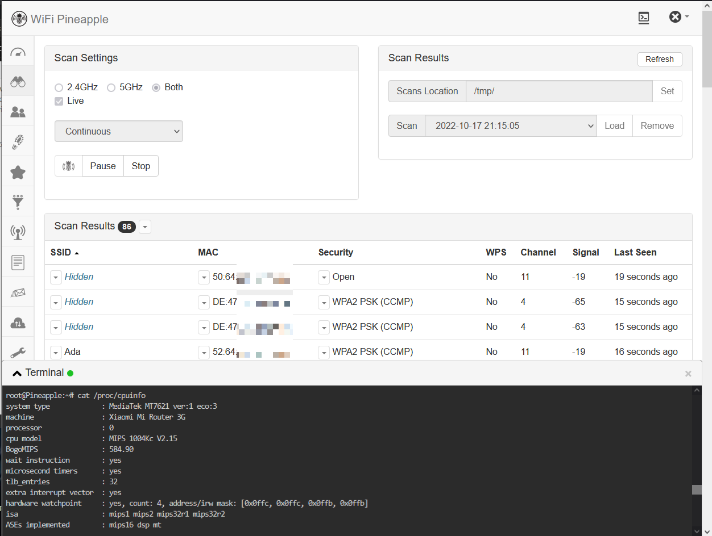

# Wifi Pineapple Cloner v4

The Pineapple NANO and TETRA are excellent security hardware but in 2020 they reached their end of life.<br>
So to give a new life to this platform on modern hardware I developed these scripts to port it to different routers.<br>

Sometime between 2019 and 2020 we started using the private beta of this project which my friends called "Pineapple Termidor".<br>
So at the time of redoing this project I decided to rescue the original name from forgotten 🤣


## About this project

This project is the result of everything I've experienced from 2018 to 2022 to successfully port the NANO and TETRA in any hardware.<br>

For this I've develop:
* The method of patching the file system with the minimum to be able to work. For this I created the list of files to copy and the script that copies them.
* A script to patch the file system to work on any hardware.
* Completely updated [panel](https://github.com/xchwarze/wifi-pineapple-panel) with fixes and improvements.
* Completely updated [packages repository](https://github.com/xchwarze/wifi-pineapple-community-packages) ([build](https://github.com/xchwarze/wifi-pineapple-community/tree/main/packages)).
* New [module repository](https://github.com/xchwarze/wifi-pineapple-community/tree/main/modules).
* And some new modules that are basic to use a device like this nowadays. New modules: [PMKIDAttack](https://github.com/xchwarze/wifi-pineapple-community/tree/main/modules/src/PMKIDAttack) and [Terminal](https://github.com/xchwarze/wifi-pineapple-community/tree/main/modules/src/Terminal)
* I also carefully checked every dependency that was installed on the device in order to have more free space on the main partition.




## Builds

You can find the complete steps to build this project in [this document](build.md). I have also added several important notes that will help you to try porting to other devices.
<br>

If you are interested in developing tools of this type, you may find my new development interesting [Frieren](https://github.com/xchwarze/frieren)
<br>


## Supported devices

There are 211 identified devices that can perfectly run the development. You can see the full [list here](devices.md). 
<br>

If you want to test the tool on unsupported routers, you can find **private versions on Patreon**.
<br>

Also I made a second repo for [downloads](https://gitlab.com/xchwarze/wifi-pineapple-cloner-builds) where you can find the firmwares already made for the most common devices of the Supported devices list.
<br>

**If your device is not in the list or you just want something more modern you can try my other project [Frieren](https://github.com/xchwarze/frieren)**
<br>

## What differences are there with other methods using by firmwares that I can download from the internet?

All the firmwares found on the internet have been created using [Patrick Sapinski's method](https://sapinski.com/2016/02/13/wifi-pineapple-firmware-for-gl-inet-gl-ar150/), which involves duplicating the entire original file system. However, this approach consumes excessive space and often leads to instability. As a result, I have developed a new and improved method.

I introduced this new method during my presentations about hardware porting at EkoParty 2020 and DragonJar 2021. You can access the materials from those [presentations here](https://github.com/indetectables-net/embedded).

In 2021, an [idiot named Samy Younsi](https://github.com/xchwarze/wifi-pineapple-cloner/issues/5), shamelessly plagiarized the method I had developed and presented at conferences. Months later, he adapted it to Python using the Wifi Pineapple Cloner v1 version and continued spreading it as his own creation.

Throughout 2022, I debugged the method and mastered its usage, enabling me to successfully port the pineapple to any hardware and achieve flawless functionality, identical to that of the original device.

Therefore, the most refined method I have devised not only significantly reduces the firmware's file size but also guarantees stability comparable to the original hardware.<br>
<br>


## Install steps

1. Install OpenWrt version 19.07.7 on your router.
<br>

2. Use SCP to upload the [firmware image](https://gitlab.com/xchwarze/wifi-pineapple-cloner-builds) in your device.
```bash
scp gl-ar750s-universal-sysupgrade.bin root@192.168.1.1:/tmp 
root@192.168.1.1's password: 
gl-ar750s-universal-sysupgrade.bin                                                                        100%   13MB   2.2MB/s   00:05 
```
<br>

3. Once the image is uploaded, execute sysupgrade command to update firmware. Wait few minutes until the device install the new firmware. 
```bash
ssh root@192.168.1.1
sysupgrade -n -F /tmp/gl-ar750s-universal-sysupgrade.bin
```
<br>

4. Enter to pineapple panel and enjoy! `http://172.16.42.1:1471/`

In the [download](https://gitlab.com/xchwarze/wifi-pineapple-cloner-builds) repo you can find some debugging tips if you have problems.
<br>

5. Once installed, the project has a tool that helps us to do several things.
For example you can use it to change the panel theme with this command:
```bash
wpc-tools theme_install
```


## Recomended setup

1. [GL-AR150](https://www.gl-inet.com/products/gl-ar150/) or [GL-AR750S](https://www.gl-inet.com/products/gl-ar750s)

2. USB 2.0 [2 ports hub](https://www.ebay.com/itm/144520475350)

3. USB Pendrive or a SD Card (depending on what your router best supports) 

4. Generic [RT5370 WIFI adapter](https://www.ebay.com/itm/284904442887) or [MT7612U WIFI adapter](https://www.ebay.com/itm/175219205235) **you're really going to need this on hardware that doesn't have two wifi adapters**

5. Please support Hak5 work and buy the new hardware!


## Patreon and Tips!

Those who want to help buy testing hardware or just give me a tip, you can do it by sending donations to my Binance account.
I also made a [Patreon](https://www.patreon.com/xchwarze) account where I share private builds and tests. Here you can find updates for the **Pineapple Nano** and builds to **improve stability** on 5g.

[](https://www.patreon.com/xchwarze)

